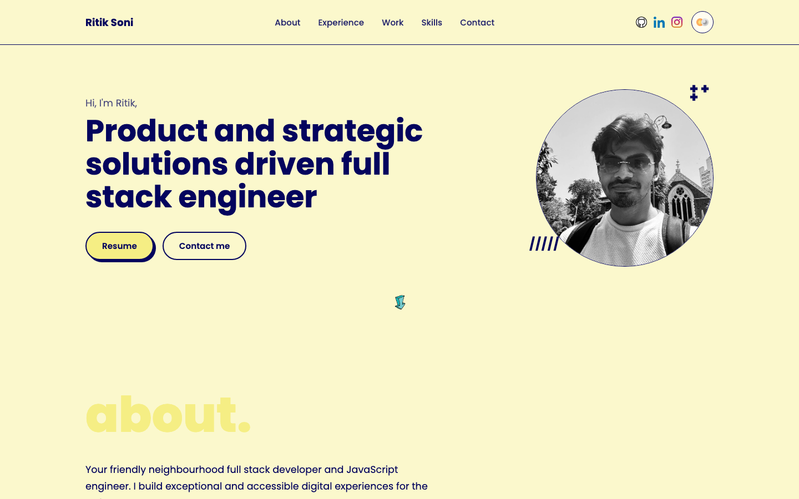
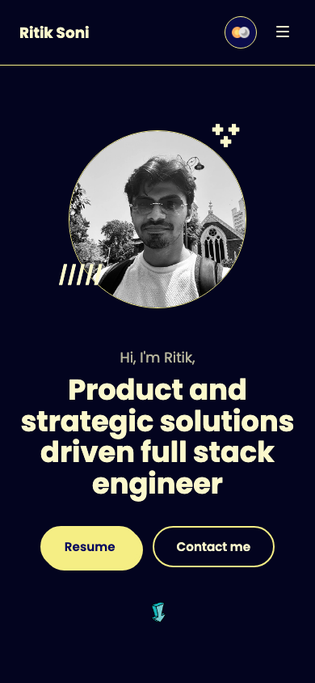

<div align="center">

# Ritik Soni — Portfolio

**Product and strategic solutions driven full stack engineer**

[](https://react.dev)
[](https://vitejs.dev)
[](#-design-system)
[](#-features)

[Live Demo](https://ritiksoni22.github.io/) · [Report an issue](https://github.com/ritiksoni22/portfolio-v3/issues)

<picture>
  <source media="(prefers-color-scheme: dark)" srcset="docs/screenshots/hero-dark.png">
  <source media="(prefers-color-scheme: light)" srcset="docs/screenshots/hero-light.png">
  
</picture>

</div>

<br>

## ✨ Features

- **One-page layout** — Hero, About, Experience, Work, Skills, and Contact in a single smooth-scrolling flow
- **Light / dark mode** — persisted to `localStorage`, defaults to the visitor's OS preference
- **Data-driven content** — experience, projects, and skills are read from plain JSON files, not hardcoded in JSX
- **Component-first** — every UI element (buttons, nav, cards, pills, theme toggle) is its own reusable component
- **Fully responsive** — collapsible nav and reflowed grid layouts down to mobile widths
- **Zero UI framework** — hand-written CSS driven entirely by design tokens, no Tailwind/Bootstrap overhead

## 🖥️ Preview

<table>
<tr>
<td align="center" width="65%">

**Desktop — light & dark**

<picture>
  <source media="(prefers-color-scheme: dark)" srcset="docs/screenshots/hero-dark.png">
  
</picture>

</td>
<td align="center" width="35%">

**Mobile**



</td>
</tr>
</table>

## 🧱 Tech stack

| Layer      | Choice                                            |
| ---------- | -------------------------------------------------- |
| Framework  | [React 19](https://react.dev) + [Vite 8](https://vitejs.dev) |
| Styling    | Plain CSS with custom properties (no CSS framework) |
| Fonts      | [Poppins](https://fonts.google.com/specials/Featured/poppins) (body/UI) & Kaushan Script (accent) — self-hosted, no CDN |
| State      | React Context for theme, local component state elsewhere |
| Data       | Static JSON (`src/data/*.json`) for experience, projects, and skills |

## 🚀 Getting started

```bash
# install dependencies
npm install

# start the dev server
npm run dev

# build for production
npm run build

# preview the production build
npm run preview
```

## 📂 Project structure

```
├── public/
│   ├── fonts/            # Poppins & Kaushan Script (self-hosted, @font-face)
│   ├── images/           # icons, portrait, decorative assets
│   └── resume.pdf
├── src/
│   ├── components/       # one folder per component: JSX + scoped CSS
│   │   ├── Button/
│   │   ├── Navbar/
│   │   ├── ThemeToggle/
│   │   ├── Hero/
│   │   ├── About/
│   │   ├── Experience/
│   │   ├── Work/
│   │   ├── Skills/
│   │   ├── Contact/
│   │   └── Footer/
│   ├── context/
│   │   └── ThemeContext.jsx   # light/dark provider + localStorage persistence
│   ├── data/
│   │   ├── experiences.json
│   │   ├── projects.json
│   │   ├── skills.json
│   │   └── contact.js
│   └── styles/
│       ├── fonts.css
│       ├── variables.css      # design tokens, light & dark
│       └── global.css
└── docs/screenshots/      # images used in this README
```

## 🎨 Design system

Colors sampled directly from the original design reference, exposed as CSS custom properties in [`src/styles/variables.css`](src/styles/variables.css):

| Token          | Hex       | Swatch |
| -------------- | --------- | ------ |
| `--navy`       | `#03045E` |  |
| `--olive`      | `#474306` |  |
| `--yellow`     | `#F5EE84` |  |
| `--pale`       | `#FBF8CC` |  |

Dark mode reuses the same palette — navy becomes the background, pale yellow becomes the text color, and yellow stays the accent — so both themes read as one consistent system rather than a bolted-on inversion.

## ✏️ Updating content

Nothing here is hardcoded — edit the JSON and the site updates:

- **Experience** → `src/data/experiences.json`
- **Projects** → `src/data/projects.json`
- **Skills** → `src/data/skills.json`
- **Contact links & resume** → `src/data/contact.js`

## 📌 Roadmap

- [ ] Swap placeholder gradient cards in Work for real project screenshots
- [ ] Wire up GitHub Pages / Actions deploy
- [ ] Add analytics

## 📬 Connect

- GitHub — [@ritiksoni22](https://github.com/ritiksoni22)
- LinkedIn — [soni-ritik](https://www.linkedin.com/in/soni-ritik/)
- Instagram — [@ritikkksoni](https://www.instagram.com/ritikkksoni/)
